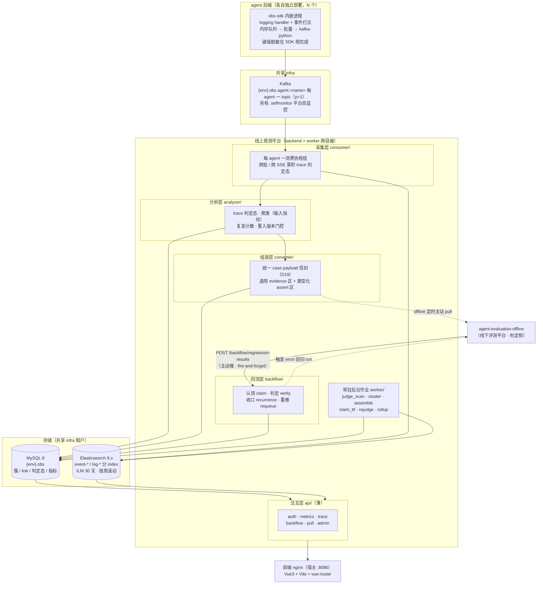

# AI Agent 线上观测平台（agent-evaluation-online）

> **多 agent 统一的线上可观测与错误回流平台**：agent 进程内嵌 SDK 采集结构化事件，经 Kafka 异步汇聚，对外提供 **traceId 链路查询 / 接口指标看板 / 异常聚类回流** 三种能力。它不止于「看」，而是把**线上真实错误**自动转化为可复现、可回归的评测资产——与线下评测平台（agent-evaluation-offline）组成 `观测 → 聚类 → 组装 → 拉取 → 判定 → 回归回推 → 收口` 的完整闭环，本平台承担**观测侧与收口侧**。**线上**——采集发生在 agent 真实运行时，观测的是生产流量本身，不做任何抽样与模拟。

第一次接触这个项目，只看下面四句就够了：

- **做什么**：把 4 个（及未来任意）agent 的线上运行情况收进一张台子——**一个 traceId 看全链路、一张看板看全接口指标、一个错误看板看全线上异常及其修复进展**；
- **怎么做**：**obs-sdk 内嵌 agent 进程**打结构化事件 → Kafka（每 agent 一 topic、partition=1 保序）→ 平台异步消费 → **判定态落 MySQL、事件与日志落 ES**（分 index、ILM 30 天按周滚动）→ API 层呈现；
- **还能做什么**：线上错误按输入指纹**自动聚类**（同错不重复开簇）→ 组装成**统一 case payload 信封**供线下平台拉取复现 → 判定结果**回推触发回归 run** → 连续 K 个纯净版本无回归则**自动收口为已修复**；
- **好在哪**：**平台定标准、agent 适配**（平台对 agent 零特判）、全链路异步、SDK 侧完成脱敏（平台不还原）、线上错误零人工搬运即可闭环；**500 项后端测试 + 261 项前端测试全绿**。

本系统是**生产级线上观测平台**：docker-compose 三服务（backend + worker + frontend）一键启动、MySQL / Kafka / Elasticsearch 全为**共享 infra 租户**接入，平台自身不托管任何中间件。

---

> **⚠️ 前置依赖：共享 infra**
>
> 本平台**不自带任何中间件**（MySQL / Kafka / Elasticsearch 等），运行前须先部署共享 infra 仓库：
>
> ```bash
> # 发布物：clone infra 独立仓库后启动
> git clone https://github.com/zhanggy1984/share-infra && cd share-infra && docker compose up -d
> cd api-gateway && docker compose up -d      # 统一网关是独立 compose，不在根 compose 内
> # 本地开发：infra 位于 ../infra
> cd ../infra && docker compose up -d
> cd api-gateway && docker compose up -d
> ```

## 目录

- [一、这是什么：解决什么痛点](#一这是什么解决什么痛点)
- [二、系统架构](#二系统架构)
- [三、快速开始（3 步跑起来）](#三快速开始3-步跑起来)
- [四、使用场景与示例](#四使用场景与示例)
- [五、接入 Agent](#五接入-agent)
- [六、技术闪光点](#六技术闪光点)
- [七、技术栈一览](#七技术栈一览)
- [八、配置说明](#八配置说明)
- [九、目录结构](#九目录结构)
- [十、测试与验收](#十测试与验收)
- [十一、开发指南](#十一开发指南)
- [十二、常见问题](#十二常见问题)
- [十三、已知限制与优化方向](#十三已知限制与优化方向)
- [文档索引](#文档索引)

---

## 一、这是什么：解决什么痛点

4 个 agent 各自独立开发，上线后普遍面临四个问题：

- **出了问题定位慢**：一次请求跨了若干次 LLM 调用、工具调用、检索、DB 访问，报错了不知道断在哪一环、参数是什么；
- **质量只有「感觉」**：哪个接口慢、哪个接口失败率高、P95 到底多少，没有统一口径的量化，跨 agent 更无从横比；
- **同一个错误反复救火**：线上报了、改了，下个版本又冒出来——**没人知道它是不是真的修好了**；
- **日志与埋点碎片化**：每个 agent 各写各的日志格式，A 家的日志 B 家读不懂，跨 agent 汇总要靠人肉。

本平台针对以上痛点，提供四种核心能力：

| 能力 | 实现 | 对应痛点 |
|------|------|---------|
| **traceId 链路查询** | SDK 统一埋点：request 为根节点，llm_call / tool_call / retrieve / db / redis 为子节点，一次查全 | 定位慢 |
| **接口指标看板** | 请求级 + LLM 调用级**双指标**，P50/P95/P99、失败率、超时率、QPS 趋势，支持跨 agent 纵览 | 质量靠感觉 |
| **异常聚类与回流** | 按输入指纹聚类（同错不重复开簇）→ 组装信封 → 线下复现判定 → 回推触发回归 → K 版纯净序列收口 | 反复救火 |
| **统一采集标准** | 平台定标准、agent 适配；接口字典由平台**从 agent 真实路由自发现**；SDK 侧完成键级脱敏 | 碎片化 |

> **一句话理解「回流闭环」**：线上出错 → 平台把这次错误的**输入现场**存下来，按指纹归到某一簇 → 组装成一封信供线下平台拉取 → 线下用这条输入真实复现、判定「到底修好没」→ 结果回推，触发该 agent 的回归 run → 连续几个纯净版本都没再犯，平台把这一簇自动标成**已修复**。**全程无需人工搬运错误现场。**

---

## 二、系统架构



> **图读法（自顶向下）**：agent 侧只做「打点 → 发 Kafka」一件事，**平台与 agent 之间唯一的耦合面就是 topic 与事件 schema**；平台内 `consumer → analyzer → converter / backflow → api` **单向推进**，api 层薄（只做路由、鉴权、解析、格式化）；**存储拆双写**——ES 存**事件与日志**（量大、可检索、走 ILM 自动滚动），MySQL 存**判定态与业务元数据**（需事务、是权威源）。

**关键链路**：agent 打点 → Kafka → 消费（累积 trace 判定态）→ 事件落 ES / 判定态落 MySQL → 聚类（输入指纹归一，同错累加、异错开簇）→ 达标簇组装为统一信封 → offline 定时 pull 走 → 线下真实复现并判定 → 结果 POST 回 online（**同事务**落库 + 判定）→ 触发该 agent 的回归 run → 自修复版本起连续 K 个纯净版本无 fail → 置 `fixed`；任一版本 fail → 立即 `reopen`。

### 两个方向的跨平台契约（重要）

平台间的数据流**双向但不对称**：

| 方向 | 承载 | 方式 |
|---|---|---|
| online → offline | 组装好的 case payload 信封 | **offline 定时主动 pull**（online 不推、offline 不直连 ES） |
| offline → online | 回归判定结果 | **offline 主动 push**（`POST /backflow/regression-results`，5s 超时、fire-and-forget） |

**online 的判定链是零出站的**——它不轮询 offline、不主动拉取任何东西：offline 在回归 run 产出后把结果推过来，online 在**接收端点内同事务**完成落库与判定。收益是 **online 侧没有对 offline 的可用性依赖**，offline 短暂不可用只让结果晚到（由本地兜底作业补判），不会让判定链卡住。

**对外链路（统一 API 网关）**：浏览器只访问前端 nginx；nginx 将 `/api` 反代到共享网关 `api-gateway:8099`（`Host: obs.local`），网关按 Host 虚拟域名路由到本平台后端，并生成 `X-Request-ID`（后端日志 `trace_id` 即此值）、按真实 IP 限流。网关由共享 infra 仓库提供（`infra/api-gateway/`），未知 Host 一律 403 防串线。**backend 已收敛：不映射宿主端口（无 `localhost:8000`），仅内网可达，对外唯一入口即前端 nginx → 网关**。

---

## 三、快速开始（3 步跑起来）

> 前置：Docker Desktop（Linux 容器）、Python 3.11。
> **共享 infra**：本平台不自带任何中间件，启动前先部署（见文首「前置依赖」）。

### 第 1 步：配置环境变量

```bash
cp .env.example .env
# 编辑 .env，至少填入（缺失则启动直接报错）：
#   DB_HOST / DB_PORT / DB_USER / DB_NAME / DB_PASSWORD   # MySQL（库 = {RESOURCE_ENV}.obs）
#   ES_URL=xxx                # Elasticsearch 地址
#   KAFKA_BOOTSTRAP=xxx       # Kafka broker
#   JWT_SECRET=xxx            # JWT 签名密钥
#   FERNET_KEYS=xxx           # 逗号分隔多代密钥（agent 凭证加密）
#   ADMIN_USERNAME=xxx / ADMIN_PASSWORD=xxx
# 注意：
#   APP_ENV / RESOURCE_ENV    决定库名、index 前缀、topic 前缀（{env}.obs.*）
#   EVALUATOR_SERVICE_SECRET  平台间服务凭证（online ↔ offline）
# 各变量完整说明见「八、配置说明」8.1。
```

### 第 2 步：启动应用容器（backend + worker + frontend）

```bash
docker compose up -d --build
# backend 启动时自动执行 alembic upgrade head 建表（幂等：存量库已到 head 无操作）
# 同时自动初始化管理员账号（存在则保持原样，无需手动 seed）
docker compose ps                 # obs-backend / obs-worker / obs-frontend 全部 Up
curl localhost:8080/healthz       # {"status":"ok"}（经前端 nginx → 网关）
```

**平台端口**（宿主侧）：

| 容器 | 宿主端口 | 容器内 | 说明 |
|------|---------|--------|------|
| backend | 无（已收敛，仅内网） | 8000 | HTTP API |
| worker | 无 | — | 常驻后台作业，无端口 |
| frontend | 8080（`FRONT_HOST_PORT`） | 80 | 静态服务 + `/api` 反代 |

> 本平台只起应用容器；MySQL / Kafka / ES 全在共享 infra。

> **为什么拆 backend 与 worker**：后台作业（聚类、组装、收口判定、指标 rollup）是**长驻批处理**，与 HTTP 请求的生命周期、资源画像、崩溃影响面都不同。分开部署后，作业卡死或 OOM 不拖垮 API，两者可各自独立重启与扩缩。**代价是改代码要分别重启对应容器**——见第十一章。

### 第 3 步：跑起来

```bash
open http://localhost:8080        # 浏览器前端
```

| 角色 | 账号 | 密码 | 可做什么 |
|------|------|------|---------|
| 管理员 | `ADMIN_USERNAME`（.env，默认 `admin`） | `ADMIN_PASSWORD`（.env 注入） | 全局配置、用户管理、错误处置（认领 / 忽略 / 复核） |
| 观察者 | 由管理员创建 | — | 只读：链路查询、指标看板、错误看板 |

> **此时页面是空的——这是正常的**：平台展示的是**真实流量**，需要有 agent 接入并产生请求。下一步见[五、接入 Agent](#五接入-agent)。
> **跑起来之后怎么用**（链路查询 / 看板下钻 / 异常处置）→ [运维手册](docs/ops-manual.md)。

---

## 四、使用场景与示例

### 4.1 给谁带来什么

**对 agent 开发方（排障）**
- **按 traceId 查全链路**：一次请求跨了几次 LLM 调用、哪一次超时、入参出参是什么，逐节点铺开；
- **按关键字反查**：只记得报错文案、不记得 traceId 也能查（接口 / error_type / error_msg / 时间窗组合过滤，**可都输可任一**）；
- **LLM 失败单独成页**：快速判断「是模型侧抖动，还是我的 prompt 结构有问题」。

**对研发负责人（看趋势）**
- **跨 agent 纵览**：一张看板横比 N 个 agent 的 QPS、失败率、超时率（agent 缺省 = 全站）；
- **接口维度下钻**：从 agent 总览下钻到单接口的 P50/P95/P99 与失败构成；
- **指标按 1h / 24h / 7d 三档**：长周期趋势走预聚合，不拖慢实时查询。

**对质量 / 运维（管闭环）**
- **异常聚合**：同一类错误归成一簇，带复发次数与首现 / 末现时间，不被噪音淹没；
- **修复进度可见**：每簇处于 `open → claim（已认领）→ fixed（已修复）` 哪一步、卡在哪一步；
- **自动收口**：修复后连续 K 个纯净版本无回归，自动标为已修复，无需人工盖章。

### 4.2 一次线上错误的完整旅程

```
① 观测   agent 调用失败 → SDK 打出结构化 error 事件（含 input 现场，已脱敏）
② 聚类   平台按 input 指纹归一：同类错误 count+1；新类型开新簇
③ 组装   达阈值后组装成统一 case payload 信封（D19），进入待拉取态
④ 拉取   offline 定时 pull 走该信封，落为 error_regression 用例并复现
⑤ 判定   线下用这条输入真实复现，判定器给出 passed / failed（禁用兜底语义）
⑥ 回推   结果 POST 回 online，同事务落库 + 判定，并触发该 agent 的回归 run
⑦ 收口   自修复版本起，连续 K 个纯净版本 run 均无 fail → 自动置 fixed
         期间任一版本 fail → 立即 reopen
```

**本平台负责 ①②③（观测侧）与 ⑦（收口侧）**，④⑤⑥ 由线下评测平台承担。

### 4.3 三个看板各自回答什么问题

| 看板 | 回答的问题 | 典型用法 |
|------|-----------|---------|
| **概览** | 全站 / 单 agent 今天健不健康？ | 看 QPS 与失败率趋势，发现异常时间段 |
| **接口** | 是哪个接口在拖后腿？ | 按接口下钻 P95 与失败构成，定位到具体路由 |
| **异常** | 有哪些错、修得怎么样？ | 按簇看复发次数与状态，推进认领 / 复核 |

---

## 五、接入 Agent

本平台是**公开、统一标准的观测系统**：任何 agent（内部自研或第三方）只要按标准埋点即可接入，**平台对 agent 零特判**。接入方 agent 独立部署（各自 docker compose），通过 Kafka 单向发送事件。

### 5.1 接入要求

| 接入要求 | 说明 |
|---------|------|
| **安装 SDK** | 本仓 `sdk/obs_sdk`；SDK 在 agent 进程内缓冲事件、批量发送，**不阻塞业务请求** |
| **事件打点** | 按契约打 `request`（根）/ `llm_call` / `tool_call` / `retrieve` / `db` / `redis` 子节点；统一携带 `trace_id` / `seq` / `interface` / `status` / `error_type` / `duration_ms` / `usage` |
| **Topic 与凭证** | 每 agent 一个 topic `{env}.obs.agent.<name>`（`partition=1`）；上报凭证由平台签发并 Fernet 加密落库 |
| **键级脱敏** | **在 SDK 侧完成，平台不还原**——敏感字段在离开 agent 进程前已被掩码 |
| **真实 usage** | token 与耗时取自模型真实返回、不估算（这是后续判定「真失败还是被兜底掩盖」的前提） |
| **接口字典** | **无需人工登记**：平台从 agent 的真实路由（FastAPI 路由 / OpenAPI）自发现 |

### 5.2 三步接入

```
Step 1  接入前盘点   确认 agent 的接口清单、后台任务边界、需要观测的关键节点
Step 2  埋点         挂上 SDK 的 logging handler + 在关键节点打事件（request/llm_call/tool_call/...）
Step 3  联通验证     起 agent → 发一次真实请求 → 在平台「接口」页确认该接口出现、「概览」页出现 QPS
```

### 5.3 接入验收 checklist

- [ ] **链路通**：平台「链路」页按 traceId 能查到该次请求，且子节点（llm_call 等）齐全；
- [ ] **指标出数**：「接口」页出现该 agent 的真实路由，且有 QPS / P95；
- [ ] **脱敏生效**：抽查链路详情，敏感字段已是掩码形态（而非原始值）；
- [ ] **不阻塞业务**：Kafka 短暂不可用时，agent 业务请求不受影响（SDK 队列满则丢弃并计数，不反压业务）；
- [ ] **失败可见**：构造一次失败调用，错误能在「异常」页聚类成簇。

> **已接入 agent 的完整走通记录**：单个 agent 从埋点改造到七环全部走通的方案与验收证据 → [gq 七环方案](docs/gq-seven-ring-plan.md) / [sp 七环方案](docs/sp-seven-ring-plan.md)。接入模式以这两份为样例，**但 sp 与 gq 不通用，不可照抄**。

---

## 六、技术闪光点

### 1. 线上错误 → 回归用例的自动化管道（本平台的核心）

大多数「可观测平台」止步于「把日志和指标画出来」。本平台往前走了一步：**让线上错误自己变成可复现、可回归的资产**。

- **按输入指纹聚类**：键 = `agent + interface + error_type 分类 + input_hash`。同一个错误反复发生只累加计数、不重复开簇；换个输入就是新问题。**幂等键怎么构造，决定了「同错不重复」这件事到底成不成立**。
- **统一 case payload 信封（D19）**：信封 = 元数据（schema_version / case_type / 幂等键 / 版本）+ **通用 evidence 区**（input、会话快照、取数证据）+ **类型化 assert 区**。新增异常类型的成本 = 加一个 `case_type` + 一个 assert 子结构 + offline 注册对应判定器，**信封结构 / 传输链路 / 去重 / 状态机全都不动**。
- **判定必须走真实复现（no_fallback）**：判定器**禁用兜底语义**——如果 agent 是「catch 住异常、返回一句兜底话术、HTTP 200」，那不叫修好，不能记为通过。兜底话术词表随信封的 assert 区**快照下发**（per-agent 含版本），避免跨平台各持一份词表而悄悄漂移。
- **K 版纯净序列收口**：「这版好了」不等于修好——可能是下一版又坏。平台要求自修复版本起**连续 K 个纯净版本**均无回归才置 `fixed`，其中「纯净」有精确定义（run 达终态 **且** run 级 na 用例数为 0，且 na 的 error_type 要按影响域判断是否牵连）。

### 2. 平台间契约：主动推 + 零出站

平台间数据流的两次反转，是本项目在架构上最值得说的一处决策：

- **出方向**：online 组装好信封后**不推**，由 offline 定时 `pull`。平台间不走公网网关，online 不需要知道 offline 在哪；
- **回方向**：offline 产出判定结果后**主动 POST** 回来，**online 零出站**（不轮询、不拉取）；
- **收益**：online 对 offline 的可用性**零依赖**；offline 短暂不可用时结果只是晚到，由本地兜底作业补判，链路不卡；
- **代价与兜底**：推送是 fire-and-forget，所以必须补一个**本地安全网**——`rejudge_job` 每 60s 扫「已认领且有现行 pending link」的簇，重放本地已落的行补判一次，专门收三类「事件到达时状态尚未就绪」的现场（认领晚于推送 / 判定抛异常被降级 / 状态过渡窗口）。

> 早期版本是反方向（online 起 job 轮询 offline 的三个读面）。**轮询链已整删**——它引入了一个平台对另一个平台的运行时依赖，且三读面的分页与时序边界极难对齐。

### 3. 采集侧：SDK 内嵌，脱敏在最上游完成

- **内嵌进程、异步批量**：SDK 在 agent 进程内用内存队列缓冲，批量发 Kafka，**不阻塞业务请求**；队列满则丢弃并计数，**不反压业务**；
- **键级脱敏在 SDK 侧完成，平台不还原**：敏感字段在离开 agent 进程之前就被掩码——**这比「平台收到后再脱敏」少一个泄露面**（也少一次「平台侧日志把明文打出来」的风险）；
- **正文默认不采**：回复正文落 ES 是**开关**（按接口逐 agent 评估数据属性后开），带开关 / 截断 / 权限 / 保留期，不以「反正脱敏了」为由默认全采。

### 4. 接口字典自发现：平台解耦于任何评测 manifest

平台的接口字典**来源于 agent 的真实路由**（FastAPI 路由 / OpenAPI），与线下评测的 manifest **完全解耦**。`llm` 标记只用于看板分类，且有自动补标 + 疑似漏标告警；**回流的判定依据是 trace 内的动态事实，不依赖人工标记**——避免「人忘了标 → 真正的错误被静默过滤掉」。

### 5. 全链路异步 + 双存储按职责分工

- 后端全链路 `async/await`：FastAPI + SQLAlchemy 2 async + aiomysql + `AsyncElasticsearch` + `aiokafka`，**没有一处同步阻塞调用混进来**；
- **双存储分工明确**：ES 存事件与日志（量大、可检索、ILM 30 天按周滚动自动清理），MySQL 存判定态与业务元数据（需事务、是权威源）。**判定态持久化在 MySQL**，消费侧重平衡时从库重建缓冲、**不回读 ES**。

### 6. 幂等贯穿全链路

- **ES `_id` = `sha256(agent | trace_id | seq)`**——键里带 agent 维度，防**跨 agent 同 trace_id 互覆**（trace_id 由各 agent 自行生成，不保证全局唯一）；
- **日志行占用 seq 编号**，与业务事件共用同一序号空间，同样走 `_id` 幂等；
- MySQL 侧聚类与 link 写入均为幂等操作，**消费重放不产生重复簇**。

### 7. 六个常驻后台作业，各司其职

| 作业 | 周期 | 职责 |
|------|------|------|
| `judge_scan` | 60s | 扫描待判定的 trace 判定态 |
| `cluster` | 15s | 聚类推进：开簇 / 累加复发 / 重入版本门控 |
| `assemble` | 60s | 达标簇组装为统一信封，进入待拉取态 |
| `claim_ttl` | 60s | 认领超期回退，收「结果未达」现场 |
| `rejudge` | 60s | **纯本地零出站**，重放已落行补判（安全网） |
| `rollup` | 对齐整点 | 指标 1h / 24h / 7d 预聚合 |

设计约束：**互不阻塞、失败可重入**。任一作业挂掉不连带其它作业，重启后从库内状态续跑；周期均为 `worker/main.py` 顶部的可配常量，不散落硬编码。

### 8. 安全基线

- **三域隔离的鉴权**：平台用户（viewer / admin，JWT）、agent 上报凭证、平台间服务凭证，三套凭证**互不通用**；
- **agent 凭证 Fernet 加密落库**：`FERNET_KEYS` 支持逗号分隔多代密钥，便于轮换；
- **接口字典自发现**替代人工登记：天然避免「登记漏了 → 该接口不被观测」；
- **密码与密钥走环境变量**，验收 / 探针脚本一律不入库、不写死凭据，缺 env 即 fail-fast。

---

## 七、技术栈一览

| 层 | 技术 | 说明 |
|----|------|------|
| 后端 | Python 3.11 + FastAPI + Uvicorn | 全异步 ASGI；`backend`（HTTP）与 `worker`（后台作业）分容器部署 |
| ORM / 迁移 | SQLAlchemy 2 (async) + aiomysql + Alembic | 异步 ORM；容器启动自动 `alembic upgrade head` |
| 事件存储 | Elasticsearch 8.x（`AsyncElasticsearch`） | 事件与日志**分 index**、ILM 30 天、按周滚动 |
| 消息队列 | Kafka（aiokafka 消费 / kafka-python 直连） | 每 agent 一 topic，`partition=1` 保序 |
| 前端 | Vue 3 + vue-router + Vite 6 + TypeScript | 自研组件与样式，**无第三方 UI 库依赖** |
| 认证 | PyJWT + bcrypt + cryptography(Fernet) | 三域隔离；agent 凭证加密落库 |
| 测试 | pytest + pytest-asyncio（后端）/ vitest + @vue/test-utils（前端） | 后端 500 项、前端 261 项 |
| 部署 | docker compose（3 服务）+ 共享 infra | 平台自身不托管任何中间件 |

---

## 八、配置说明

### 8.1 环境变量（`.env`，完整模板见 `.env.example`）

| 变量 | 必填 | 说明 |
|------|:---:|------|
| `APP_ENV` / `RESOURCE_ENV` | ✅ | 环境标识，决定库名 / index 前缀 / topic 前缀（`{env}.obs.*`） |
| `DB_HOST` / `DB_PORT` / `DB_USER` / `DB_NAME` / `DB_PASSWORD` | ✅ | MySQL 连接（库 = `{RESOURCE_ENV}.obs`） |
| `DB_MIGRATE_USER` / `DB_MIGRATE_PASSWORD` | ⬜ | 迁移专用账号（与运行账号分离） |
| `ES_URL` | ✅ | Elasticsearch 地址 |
| `KAFKA_BOOTSTRAP` / `KAFKA_CONSUMER_GROUP` | ✅ | Kafka broker 与消费组 |
| `JWT_SECRET` / `JWT_ACCESS_MINUTES` / `JWT_REFRESH_DAYS` | ✅ | 平台用户 JWT |
| `FERNET_KEYS` | ✅ | agent 凭证加密密钥，逗号分隔多代 |
| `EVALUATOR_SERVICE_SECRET` | ✅ | 平台间服务凭证（online ↔ offline） |
| `OFFLINE_BASE_URL` | ⬜ | 线下评测平台地址（**判定链本身零出站**，仅用于生成回推地址） |
| `ADMIN_USERNAME` / `ADMIN_PASSWORD` | ✅ | 初始管理员（启动时自动初始化，存在则保持原样） |
| `CORS_ORIGINS` | ⬜ | CORS 白名单 |
| `FRONT_HOST_PORT` | ⬜ | 前端宿主端口（默认 `8080`） |

### 8.2 命名空间（`{RESOURCE_ENV}` 前缀）

| 资源 | 形态 |
|------|------|
| MySQL 库 | `{env}.obs` |
| ES index | `{env}.obs-event-*`（事件）/ `{env}.obs-log-*`（日志） |
| Kafka topic | `{env}.obs.agent.<name>`（每 agent 一个）/ `{env}.obs.selfmonitor`（平台自监控） |

> ⚠️ **检索面注意**：后端查询走的是 **event + log 两个 index 的并集**（`store/es.py::index_patterns`）。**只查其中一个会得到偏小的数**——自己写数据核对探针时尤其要留意这点。

---

## 九、目录结构

```
agent-evaluation-online/
├── backend/                     # FastAPI 后端（obs-backend 与 obs-worker 共用同一份源码）
│   ├── app/
│   │   ├── main.py              # HTTP 应用入口
│   │   ├── api/                 # 交互层（薄）：REST 路由
│   │   │                        #   auth / metrics / trace / backflow / pull / admin
│   │   ├── consumer/            # 采集层：Kafka 消费（每 agent 一消费协程组）
│   │   ├── analyzer/            # 分析层：trace 判定态 / 聚类 / 复发 / 重入版本门控
│   │   ├── converter/           # 组装层：统一 case payload 信封（D19）
│   │   ├── backflow/            # 回流层：ack / batches / claim / recurrence / requeue / verify
│   │   ├── worker/              # 后台作业：judge_scan · cluster · assemble
│   │   │                        #          claim_ttl · rejudge · rollup
│   │   ├── store/               # 存储访问：es.py（index 命名与查询）
│   │   ├── models/              # SQLAlchemy ORM
│   │   └── core/                # 配置 / 安全 / 错误 / 种子（含管理员初始化）
│   ├── tests/                   # 后端测试（500 项）
│   ├── alembic/                 # 数据库迁移
│   └── pyproject.toml
├── sdk/obs_sdk/                 # 内嵌 agent 进程的采集 SDK（事件打点 + 脱敏 + 批量发送）
├── frontend/                    # Vue 3 + Vite
│   └── src/
│       ├── views/               # 概览 / 链路 / 链路详情 / 接口 / LLM 失败
│       │                        #   / 异常 / 回流 / 簇详情 / 配置 / 用户 / 登录
│       ├── components/          # 自研图表与过滤条
│       └── api/                 # axios 接口模块
├── docs/                        # 运维手册 / 集成报告 / 七环方案 / infra 接入矩阵
├── docker-compose.yml           # 3 服务（backend + worker + frontend）+ 共享 infra 引用
├── .env.example                 # 环境变量模板
├── solution.md                  # 技术方案（v3.5.x，含 D1~D20 关键决策总览）
├── solution_detail.md           # 技术方案明细
├── task.md                      # 任务拆分与验收
└── README.md
```

**后端分包**：`consumer`（采集）→ `analyzer`（分析）→ `converter`（组装）→ `backflow`（回流）为单向推进的处理链，`worker` 承载常驻作业，`api` 只做对外呈现，`store` / `models` / `core` 为基础设施。新增能力一般改 `api/` + 对应处理层。

---

## 十、测试与验收

```bash
# 后端单测（不连库，宿主直接跑；backend/.venv 已存在）
cd backend && .venv/Scripts/python.exe -m pytest tests -q

# 静态检查（pre-commit hook 不含 lint，必须手动跑）
cd backend && .venv/Scripts/python.exe -m ruff check app tests alembic

# 前端单测
cd frontend && npx vitest run

# 前端构建（含 vue-tsc --noEmit 类型检查）
cd frontend && npm run build
```

**实测全绿**：后端 **500 项**（`pytest --collect-only` 收集数）、前端 **261 项**（vitest，19 个测试文件全过）。

后端测试覆盖（`backend/tests/`）：

- **采集与判定态**：Kafka 消费、跨批 / 跨 SSE 累积判定态、重平衡重建；
- **分析层**：聚类（输入指纹、同错累加、异错开簇）、复发计数、重入版本门控；
- **组装层**：统一信封结构、evidence 区、assert 区；
- **回流层**：认领状态机、判定器（含 no_fallback）、K 版纯净序列收口、重推；
- **API 与安全**：路由、鉴权三域隔离、指标聚合、密码与密钥校验。

**端到端闭环验证**：四个接入 agent（good-question / customer-service / contract-check / smart-procurement）均以**主动故障注入**方式走过完整七环——把依赖指向黑洞地址制造确定性 DNS / 连接类失败，再观察该 error 能否自动被观测、聚类、组装、推送、复现、判定、回推、收口。每一步都有落库产物可核（ES 事件 → 聚类行 → 回流信封 → 回归用例 → 判定结果 → 收口记录）。

> 主动注入而非等真实事故，是因为它**可重复、可控、可对照**；真出事故时，链路是否可靠不该是第一次被验证的东西。

---

## 十一、开发指南

### 环境

```bash
cp .env.example .env
docker compose up -d --build        # 起平台（backend + worker + frontend）
docker compose ps                   # 三容器 Up
```

### 改代码后怎么生效（**本仓最容易踩的一处，务必读完**）

三个容器的失效机制**完全不同**，别套用同一条结论：

| 改了什么 | 为什么没生效 | 正确动作 |
|---|---|---|
| 前端 | `obs-frontend` 是**多阶段构建的 baked 镜像**，无 bind mount——宿主 build 不出现在容器里 | `docker compose build frontend && docker compose up -d --force-recreate frontend` |
| 后端 API | `obs-backend` **有** bind mount（`./backend:/app`），但 uvicorn **没带 `--reload`**——文件是新的、进程跑的是旧代码 | `docker compose restart backend` |
| 后端 job —— **不只是 `worker/*.py`** | 作业跑在**另一个容器** `obs-worker` 里（同 bind mount、同样无 `--reload`） | `docker compose restart worker` |
| **`app/` 下任何被作业 import 的模块**（`converter/`、`backflow/`、`analyzer/`…） | 同上——它是经 `obs-worker` 的 import 进入运行时的 | 同样 `docker compose restart worker` |

> ⚠️ **两条血泪判据**：
> 1. **触发面是「谁在跑这份代码」，不是「我改了哪个文件名」。** 改一个 `app/converter/envelope.py`（看起来像 backend 的东西），实际生效要重启的是 **worker**。
> 2. **这类陈旧不产生任何红灯**——接口照常回 200、返回的驳回理由长得像正常的业务原因。**「没生效」和「功能没被用到」在读数上完全同形，无法只从结果反推。**
>
> 另外：`docker compose logs backend` 里**只有 HTTP 访问日志、一条 job 日志都没有**——那正是「worker 不在这个容器里」的判据。

### 新增接口

`api/` 子包新增 router → 注册到 `api/router.py` → 前端 `api/` 模块 → 按角色挂权限。

### 新增后台作业

`worker/` 下新增 job 模块 → 在 `worker/main.py` 注册协程与周期常量 → **必须同步重启 `obs-worker`**。

### 数据库变更

改模型后 `docker compose exec backend alembic revision --autogenerate -m "描述"` → `alembic upgrade head`。

### 改 SDK

SDK 装在 agent 侧进程内，**改完必须随 agent 一起重新部署**，平台侧重启对它无效。

### 跑测试 / 验收

后端单测不连库直接跑；前端单测与构建命令见[第十章](#十测试与验收)。提交前先跑单测，确保不破坏既有用例。

### 编码规范（约定）

- 4 空格缩进；注释写「为什么」、中文注释、英文标识符；
- 新增接口 / 消费者打印入参出参（debug 级）；
- 核心逻辑（Service 业务分支，含正路径与关键异常路径）必须单测覆盖。

---

## 十二、常见问题

| 现象 | 处理 |
|------|------|
| 改了后端代码不生效 | bind mount 生效但 uvicorn 无 `--reload`：`docker compose restart backend` |
| 改了 job / 被 job import 的模块不生效 | 作业跑在 `obs-worker`：`docker compose restart worker`（**改 `converter/`、`backflow/` 这类模块也一样**） |
| 改了前端不生效 | 前端是 baked 镜像：`docker compose build frontend && docker compose up -d --force-recreate frontend` |
| `docker compose logs backend` 里看不到任务日志 | 正常——作业在 `obs-worker` 容器，改看 `docker compose logs worker` |
| 前端页面能开但 API 全 502 | nginx 钉了重启前的旧 upstream IP：`docker compose restart frontend`（不用动 backend） |
| 启动后页面全空 | 平台展示的是**真实流量**：需要先接入 agent 并产生请求（见第五章） |
| 概览页没有某 agent 的曲线 | 该 agent 尚未有流量；SDK 为批量发送，冷启动有秒级延迟 |
| 接口页看不到某个接口 | 接口字典来自真实路由 + **实际流量**，要有过一次请求才会出现 |
| 按关键字查链路查不到 | 确认是否只查了 event 或只查了 log——后端走两个 index 的**并集**，自写核对探针时尤其注意 |
| 真机取证时页面没反应 | 旧标签页的模块级单例早已加载——**必须新开标签页**再验 |
| 异常簇一直停在 `claim` 不动 | 看它是否在等 offline 结果；`rejudge` 是本地安全网但不会凭空造出结果 |
| 返回体里的驳回理由看起来正常但行为不对 | 先怀疑**代码没生效**（见开发指南的容器表），再怀疑逻辑 |

---

## 十三、已知限制与优化方向

**如实说明当前已知的边界问题与取舍：**

1. **同一 agent 的消费并行度受 topic 设计限制**：每 agent 一 topic、`partition=1`，是为保证**同一 agent 内的事件时序可累积**（判定「一个 trace 是否完整」依赖跨批、跨 SSE 的累积态）。代价是单 agent 消费吞吐上限 = 单分区吞吐。当前 4 个 agent 的流量规模下不构成瓶颈；若某 agent 增长到需要横向扩消费端，需改为「按 trace_id 哈希分区」——**而前提是先证明累积态判定不再依赖全局序**。

2. **ES 与 MySQL 之间为最终一致**：事件落 ES、判定态落 MySQL，两者间无分布式事务。设计上以 **MySQL 为权威**（判定、状态机、收口全走 MySQL），ES 只承担「可检索」职责——ES 短暂写入失败不会导致判定错误，最多是链路查询暂时查不到。代价是**不能用 ES 的计数反推业务状态**（两者可能短暂不等）。

3. **「纯净版本」判据依赖对未执行用例的正确归因**：K 版收口要求「该版 run 纯净」，而 run 里出现 na（未执行）用例时必须判断它是**环境级**（不该牵连本簇）还是**用例级**（该牵连）。这套 error_type 影响域分流是语义映射，**新增 error_type 时必须同步维护**；漏维护的表现是按从严分支静默处理，**不会报错**。

4. **平台自身不自带中间件**：MySQL / Kafka / ES 全为共享 infra 租户，平台无 broker 管理权（topic / ACL 需向 infra 申请落权）。好处是平台镜像极轻、部署面干净；代价是**本地起全链路必须先起 infra**，且多租户共享意味着容量问题不一定出在自己这边。

5. **判定链零出站的代价是「结果晚到无告警」**：offline 推送失败时 online 不重试（由 offline 侧重试 + 本地 `rejudge` 兜底）。极端情况下（offline 长时间不可用、且本地也无可重放的已落行），簇会停留在 `claim` 直到认领 TTL 到期回退——**这是「有兜底但不保证即时」的有意设计**，不是遗漏。

6. **正文默认不采集**：内容型数据的可见性依赖采集策略（默认关 + 最小化）控制，而非事后掩码。这是隐私上的保守选择，代价是**部分「答案质量类」的排查场景缺原始正文**，需按接口逐 agent 评估后单独开启。

---

## 文档索引

- **技术方案**：[solution.md](solution.md)（v3.5.x，含 D1~D20 关键决策总览与逐版修订记录）
- **方案明细**：[solution_detail.md](solution_detail.md)（落地口径、评审问题包与裁定记录）
- **任务拆分与验收**：[task.md](task.md)
- **运维手册**：[docs/ops-manual.md](docs/ops-manual.md)（日常运维与故障处置）
- **集成报告**：[docs/integration-report.md](docs/integration-report.md)
- **infra 接入矩阵**：[docs/infra-access-matrix.md](docs/infra-access-matrix.md)
- **七环走通记录（gq / sp）**：[docs/gq-seven-ring-plan.md](docs/gq-seven-ring-plan.md)、[docs/sp-seven-ring-plan.md](docs/sp-seven-ring-plan.md)
- **项目约定**：[CONTRIBUTING.md](CONTRIBUTING.md)（架构 / 目录 / 质量基线）
